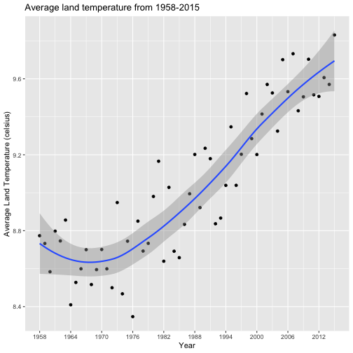

This group project has provided immense and thorough insight to climate change. However, we would like to highlight 3 key takeaways:

1.  The average global surface temperature and carbon emission levels have been steadily increasing throughout the years. Specifically, for global surface temperature, from 1976 to 2018, there was an increase of **1.49 C** within a span of 42 years. For carbon emission levels,from 1975 to 2017, there was an increase of **75.21** ppm within a span of 42 years. In addition, the frequency of natural disasters have also been increasing.

    

    

2.  While climate change is a global phenomenon, each country and region experiences climate change different such as through natural disasters. For island nations such as Indonesia, they have been increasingly experiencing disasters such as floods and landslides due to climate change. However, for a different country such as the United States, common disasters are drought, earthquakes, and extreme temperatures.

3.  There is an urgent need to address and challenge systems contributing to climate change. If the current trends for these variables continue, this may set a dangerous path for the future as will we experience more negative experiences associated with climate change such as natural disasters.
